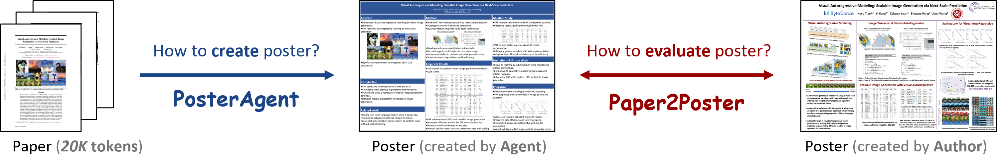
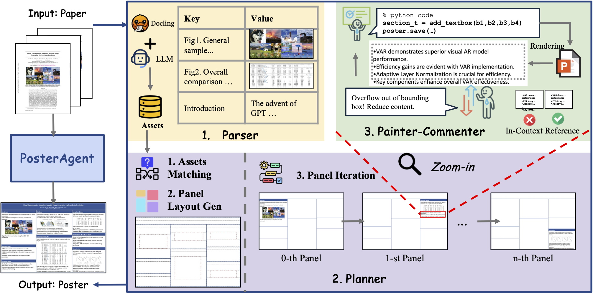
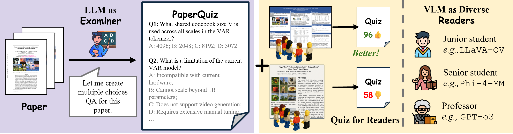

# 🎓Paper2Poster: Multimodal Poster Automation from Scientific Papers

<p align="center">
  <a href="https://arxiv.org/abs/2505.21497" target="_blank"></a>
  <a href="https://paper2poster.github.io/" target="_blank"></a>
  <a href="https://huggingface.co/datasets/Paper2Poster/Paper2Poster" target="_blank"></a>
  <a href="https://huggingface.co/papers/2505.21497" target="_blank"></a>
  <a href="https://x.com/_akhaliq/status/1927721150584390129" target="_blank"></a>    
</p>

We address **How to create a poster from a paper** and **How to evaluate poster.**



<!--## 📚 Introduction-->

**PosterAgent** is a top-down, visual-in-the-loop multi-agent system from `paper.pdf` to **editable** `poster.pptx`.



<!--A Top-down, visual-in-the-loop, efficient multi-agent pipeline, which includes (a) Parser distills the paper into a structured asset library; the (b) Planner aligns text–visual pairs into a binary‐tree layout that preserves reading order and spatial balance; and the (c) Painter-Commentor loop refines each panel by executing rendering code and using VLM feedback to eliminate overflow and ensure alignment.-->

<!---->

<!--**Paper2Poster:** A benchmark for paper to poster generation, paired with human generated poster, with a comprehensive evaluation suite, including metrics like **Visual Quality**, **Textual Coherence**, **VLM-as-Judge** and **PaperQuiz**. Notably, PaperQuiz is a novel evaluation which assume A Good poster should convey core paper content visually.-->

## 📋 Table of Contents

<!--- [📚 Introduction](#-introduction)-->
- [🛠️ Installation](#-installation)
- [🚀 Quick Start](#-quick-start)
- [🔮 Evaluation](#-evaluation)
---

## 🛠️ Installation
Our Paper2Poster supports both local deployment (via [vLLM](https://docs.vllm.ai/en/v0.6.6/getting_started/installation.html)) or API-based access (e.g., GPT-4o).

**Python Environment**
```bash
pip install -r requirements.txt
```

**Install Libreoffice**
```bash
sudo apt install libreoffice
```

or, if you do **not** have sudo access, download `soffice` executable directly: https://www.libreoffice.org/download/download-libreoffice/, and add the executable directory to your `$PATH`.

**Install poppler**
```bash
conda install -c conda-forge poppler
```

**API Key**

Create a `.env` file in the project root and add your OpenAI API key:

```bash
OPENAI_API_KEY=<your_openai_api_key>
```

---

## 🚀 Quick Start
Create a folder named `{paper_name}` under `{dataset_dir}`, and place your paper inside it as a PDF file named `paper.pdf`.
```
📁 {dataset_dir}/
└── 📁 {paper_name}/
    └── 📄 paper.pdf
```
To use open-source models, you need to first deploy them using [vLLM](https://docs.vllm.ai/en/v0.6.6/getting_started/installation.html), ensuring the port is correctly specified in the `get_agent_config()` function in [`utils/wei_utils.py`](utils/wei_utils.py).

- [High Performance] Generate a poster with `GPT-4o`:

```bash
python -m PosterAgent.new_pipeline \
    --poster_path="${dataset_dir}/${paper_name}/paper.pdf" \
    --model_name_t="4o" \  # LLM
    --model_name_v="4o" \  # VLM
    --poster_width_inches=48 \
    --poster_height_inches=36
```

- [Economic] Generate a poster with `Qwen-2.5-7B-Instruct` and `GPT-4o`:

```bash
python -m PosterAgent.new_pipeline \
    --poster_path="${dataset_dir}/${paper_name}/paper.pdf" \
    --model_name_t="vllm_qwen" \  # LLM
    --model_name_v="4o" \         # VLM
    --poster_width_inches=48 \
    --poster_height_inches=36 \
    --no_blank_detection          # An option to disable blank detection
```

- [Local] Generate a poster with `Qwen-2.5-7B-Instruct`:

```bash
python -m PosterAgent.new_pipeline \
    --poster_path="${dataset_dir}/${paper_name}/paper.pdf" \
    --model_name_t="vllm_qwen" \           # LLM
    --model_name_v="vllm_qwen_vl" \        # VLM
    --poster_width_inches=48 \
    --poster_height_inches=36
```

PosterAgent **supports flexible combination of LLM / VLM**, feel free to try other options, or customize your own settings in `get_agent_config()` in [`utils/wei_utils.py`](utils/wei_utils.py).

## 🔮 Evaluation
Download Paper2Poster evaluation dataset via:
```bash
python -m PosterAgent.create_dataset
```

In evaluation, papers are stored under a directory called `Paper2Poster-data`.

To evaluate a generated poster with **PaperQuiz**:
```bash
python -m Paper2Poster-eval.eval_poster_pipeline \
    --paper_name="${paper_name}" \
    --poster_method="${model_t}_${model_v}_generated_posters" \
    --metric=qa # PaperQuiz
```

To evaluate a generated poster with **VLM-as-Judge**:
```bash
python -m Paper2Poster-eval.eval_poster_pipeline \
    --paper_name="${paper_name}" \
    --poster_method="${model_t}_${model_v}_generated_posters" \
    --metric=judge # VLM-as-Judge
```

To evaluate a generated poster with other statistical metrics (such as visual similarity, PPL, etc):
```bash
python -m Paper2Poster-eval.eval_poster_pipeline \
    --paper_name="${paper_name}" \
    --poster_method="${model_t}_${model_v}_generated_posters" \
    --metric=stats # statistical measures
```

If you want to create a PaperQuiz for your own paper:
```bash
python -m Paper2Poster-eval.create_paper_questions \
    --paper_folder="Paper2Poster-data/${paper_name}"
```

## ❤ Acknowledgement
We extend our gratitude to [🐫CAMEL](https://github.com/camel-ai/camel), [🦉OWL](https://github.com/camel-ai/owl), [Docling](https://github.com/docling-project/docling), [PPTAgent](https://github.com/icip-cas/PPTAgent) for providing their codebases.

## 📖 Citation

Please kindly cite our paper if you find this project helpful.

```bibtex
@misc{paper2poster,
      title={Paper2Poster: Towards Multimodal Poster Automation from Scientific Papers}, 
      author={Wei Pang and Kevin Qinghong Lin and Xiangru Jian and Xi He and Philip Torr},
      year={2025},
      eprint={2505.21497},
      archivePrefix={arXiv},
      primaryClass={cs.CV},
      url={https://arxiv.org/abs/2505.21497}, 
}
```
